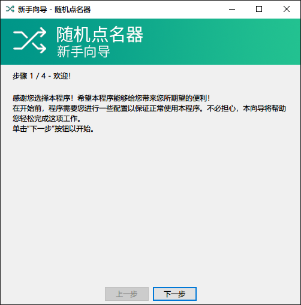
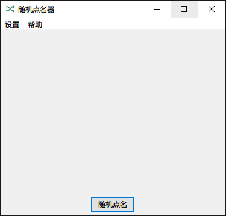
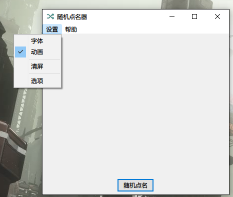
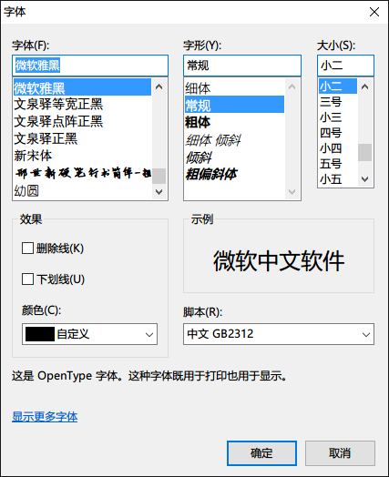
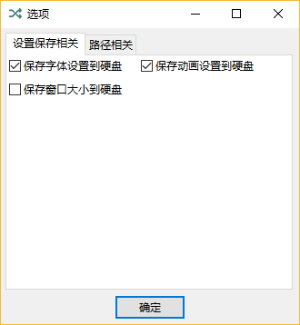
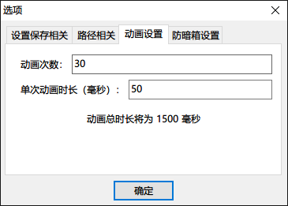
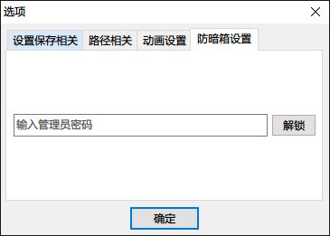
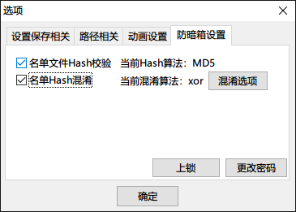
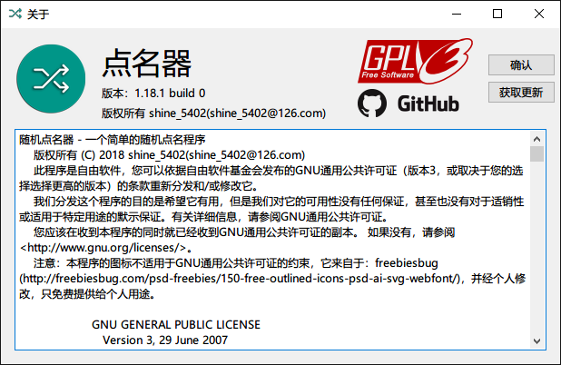

# 随机点名器

## 简明介绍

一个简单易用的随机点名器。一个典型的使用场景是老师上课随机叫学生回答问题，这会比老师自己随机报名更加客观。您可以使用本程序活跃课堂气氛，也可以使用本程序做出一些随机决策。

## 使用说明

### 新手向导

本程序设置了新手向导，可以引导用户对本程序进行初始配置。您只需要下载后运行，并跟随向导指引即可。

### 主界面

这是程序的主界面。

点击“随机点名”按钮即可开始随机点名。在菜单栏您可以进行其他操作。

#### 设置菜单

用户可以在设置菜单中更改本程序的设置。比如您可以在设置菜单中修改程序使用的字体，程序在随机显示名字时是否使用动画等等。本程序在“设置”菜单中提供的菜单项自上而下分别是：

1. **字体**：您可以使用此菜单设置显示名字时所使用的字体（包括大小、粗细等）。本程序使用Win32 API提供的标准字体选择窗口。

    

2. **动画**：这是一个开关类型的菜单项。它可以控制随机显示名字时是否使用闪动动画。使用此动画可以营造紧张刺激的氛围。对于动画的更多高级设置请进入选项窗口修改。

3. **清屏**：本菜单项用于清除屏幕上现存的名字。

4. **选项**：本菜单项会打开“选项”窗口，您可以在这里调整本程序为您提供的各项设置。

    1. **设置保存相关**选项卡：您可以在这里控制程序需要记住的设置，如字体、动画设置、窗口大小等。

        

    2. **路径相关**选项卡：您可以在这里调整本程序所使用到的路径。现在只支持调整名单文件路径。

        

    3. **动画设置**选项卡：您可以在这里调整本程序动画的效果。本选项卡只有在您开启动画效果之后才会出现。

        

    4. **防暗箱设置**（密码输入窗）选项卡：您需要在这一选项卡输入您设置的管理员密码才可以打开防暗箱设置。

        

    5. **防暗箱设置**（设置调整窗）选项卡：您可以在这一选项卡修改本程序的防暗箱设置，这可以帮助您避免其他用户篡改名单文件而造成的不公平问题。

        

        本页面还有三个按钮：

        1. **混淆选项**：您可以使用此按钮调整混淆算法的设置。目前版本您可以调整xor的另一操作数。

        2. **上锁**：单击本按钮后，您将退出管理员模式。您必须重新输入密码才可以修改管理员设置。

        3. **更改密码**：您可以使用本按钮修改您的管理员密码。这需要您记住原密码。

#### 帮助菜单

本菜单目前只有一个菜单项：“关于”。它会打开关于窗口。

您可以在关于窗口查看程序版本和程序协议，并通过Github的发布页检查更新。