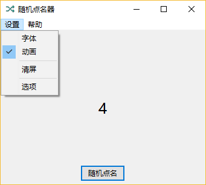

# 随机点名器
### 一个简单易用的随机点名器。
**注意：本程序需要在下载后手动在根目录创建一个文件（默认文件名为names.txt），在这里放入要随机的名单，一行一个名字。（以后说不定会支持去空行和注释的撒(ﾉ･ω･)ﾉﾞ）**

*主界面截图*

点击“随机点名”按钮即可开始随机点名，需要的话可以在设置菜单中设置字体、动画开关等哦(○’ω’○)

*设置菜单截图*

这里好像没什么可讲的 \_(:3 」∠)\_ 字面意思啦\_(┐「ε:)\_

*设置保存相关选项截图*

可以在这里设置这些开关哦(´・ω・`)

*路径相关选项截图*

在这里的话可以把随机的名字路径更改掉哦 (´・ω・)ﾉ

所有选项都是立即生效的呢(。-`ω´-)，不过客官要记得点确定哦(｀･ω･´)，要不然不生效就没有什么办法了呢╮(╯▽╰)╭。

对了对了，如果有发现任何bug的话，请务必提交Issue，在我能力范围内会修哒 \*★,°\*:.☆\(￣▽￣)/.:\*.°★\*  

Todo:
[]名单去空行
[]名单注释
[]名单Hash校验
[]名单混淆
